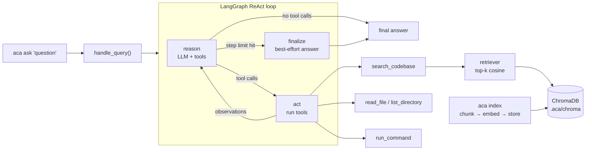

# Agentic Code Assistant (`aca`)

A command-line AI assistant you run **inside any other project** to ask questions about its code.

```text
$ cd ~/some-project
$ aca ask "How does the retry logic work?"

act      search_codebase(query='retry logic')
observe  ### src/http/client.py:41-78 ...
act      read_file(path='src/http/client.py', start_line=41, end_line=90)
observe  41: def request_with_retry(...
╭──────────────────────────── Answer ────────────────────────────╮
│ Retries are implemented in `request_with_retry` (client.py:41)… │
╰─────────────────────────────────────────────────────────────────╯
```

**Built with:** Python 3.12 · LangGraph · LangChain · ChromaDB · OpenAI · DeepEval

## What it does

| Capability | How |
| --- | --- |
| **ReAct agent (LangGraph)** | The model *reasons*, picks a tool, *acts*, reads the result, and repeats until it can answer. The loop is an explicit LangGraph state graph (`agent/graph.py`). |
| **Tools it can choose from** | `search_codebase` (RAG), `read_file`, `list_directory`, `run_command` (restricted shell). |
| **Iteration limits & error handling** | Hard cap on reasoning steps (then a forced best-effort answer). Tool failures become observations the agent can recover from; API failures become readable messages. |
| **RAG with ChromaDB** | Code-aware chunking → OpenAI embeddings → cosine top-k retrieval. Incremental indexing (unchanged files are skipped). |
| **Context-window safety** | Every tool result is trimmed to a token budget; search results drop whole low-ranked chunks instead of cutting code in half. |
| **Evaluated with DeepEval** | Retrieval: precision@k and recall@k. Agent: task completion + answer correctness. All on a fixture project the tool has never seen. |

> **Design rule:** like Claude Code, `aca` is a tool you point at *someone else's* project. It is never evaluated on questions about its own source; evals run against `tests/evals/fixtures/sample_project`.

## Architecture



### Project layout

```text
agentic_code_assistant/
├── cli.py                  # `aca index`, `aca ask`
├── config.py / config.yaml # typed settings (model, top_k, chunk size, limits)
├── context.py              # token counting + trimming of tool output
├── paths.py                # project-root sandbox helpers (no path escapes, no secret files)
├── tracing.py              # optional DeepEval @observe (off unless evaluating)
├── agent/
│   ├── graph.py            # the ReAct state graph: reason → act → … → finalize
│   ├── factory.py          # LLM + tools + graph assembled into an agent
│   ├── orchestrator.py     # handle_query(): the one entry point (CLI + evals)
│   ├── tools.py            # search_codebase (RAG tool)
│   └── prompts.py          # system prompt
├── rag/
│   ├── chunker.py          # AST-based code chunking (+ line-window fallback)
│   ├── embeddings.py       # OpenAI embeddings
│   ├── store.py            # ChromaDB collection / IndexLocation
│   ├── indexer.py          # incremental indexing (hash-based skip)
│   └── retriever.py        # top-k retrieval (shared by tool AND evals)
└── tools/
    ├── filesystem_tools.py # read_file, list_directory
    └── terminal_tools.py   # run_command (allowlist, no shell, timeout)

tests/
├── unit/                   # 60 offline tests, no API key needed
└── evals/                  # DeepEval suites (need OPENAI_API_KEY)
    ├── fixtures/sample_project/    # hand-written target project (expense tracker)
    ├── dataset_rag.json            # 15 hand-written retrieval goldens
    ├── dataset_codebase_agent.json # 13 hand-written agent goldens
    ├── test_rag_pipeline.py        # precision@k, recall@k
    └── test_codebase_agent.py      # task completion, answer correctness
```

## Quickstart

Requires Python 3.12+ and [uv](https://docs.astral.sh/uv/) (`pip install uv` works too).

```bash
# 1. install
cd agentic-code-assistant
uv sync --group dev

# 2. add your key
cp .env.example .env          # Windows PowerShell: Copy-Item .env.example .env
# then edit .env and set OPENAI_API_KEY=sk-...

# 3. run the offline tests (free, no key needed)
uv run pytest
```

### Try it on the demo project

```bash
cd tests/evals/fixtures/sample_project
uv run --project ../../../.. aca ask "What happens when an expense goes over budget?"
```

`aca ask` refreshes the index of the current directory first (the first run embeds everything; later runs skip unchanged files), then runs the agent.

### Use it on your own projects

Install once as a global command, then run it from any project:

```bash
uv tool install --editable /path/to/agentic-code-assistant

cd ~/my-other-project
aca ask "Where is authentication handled?"
aca ask "Which tests cover the payment module?" --quiet   # hide the tool steps
aca index                                                  # refresh the index manually
```

> Use `uv run --project <aca-dir> aca ...`, **not** `--directory`: `--directory` changes the working directory to ACA itself, so `aca` would index its own source.

The index is stored in `.aca/chroma` inside the project you ask about. Add `.aca/` to that project's `.gitignore`.

## Configuration

Defaults are in `agentic_code_assistant/config.yaml` (point the `ACA_CONFIG` env var at another file to override).

| Setting | Default | Meaning |
| --- | --- | --- |
| `llm.model` | `gpt-4o-mini` | Agent model (`OPENAI_MODEL` overrides) |
| `embeddings.model` | `text-embedding-3-small` | Embedding model (`OPENAI_EMBEDDING_MODEL` overrides) |
| `agent.max_iterations` | `10` | Max reasoning steps before a forced answer |
| `agent.max_tool_output_tokens` | `3000` | Token budget for every tool observation |
| `rag.top_k` | `5` | Chunks returned per search |
| `rag.chunk_lines` / `chunk_overlap` | `60` / `10` | Max chunk size; overlap when a big function is split |
| `rag.max_file_bytes` | `200000` | Files larger than this are not indexed |
| `terminal.timeout_seconds` | `30` | Per-command timeout |

## How it works

### 1. The ReAct loop (`agent/graph.py`)
State is the message history plus a step counter. Three nodes:
- **reason**: send the conversation to the LLM (with tool schemas). It returns either a final answer or one or more tool calls.
- **act**: run the requested tools; each result is appended as a `ToolMessage` (the *observation*).
- **finalize**: only if the step budget runs out while the model still wants tools. The pending request is dropped and the model is told to answer with what it has and state what it could not verify.

Routing after `reason`: no tool calls → end; tool calls and budget left → `act`; tool calls but no budget → `finalize`. `ToolNode(handle_tool_errors=True)` turns tool exceptions into observations. LangGraph's `recursion_limit` is set only as a backstop.

### 2. RAG (`rag/`)
- **Chunking:** Python files are parsed with `ast` so each function / method is its own chunk (large classes are split into methods; huge functions into overlapping windows). Other files use overlapping line windows. Each chunk is prefixed with `# path :: Class.method` so the embedding also captures *where* the code lives.
- **Indexing:** files are hashed together with the chunking/embedding settings; unchanged files are skipped, changed files re-embedded, deleted files removed. Ignores `.git`, `node_modules`, `.venv`, lockfiles, binaries and huge files.
- **Retrieval:** embed the query, take the cosine top-k from ChromaDB, best first. `search_codebase` formats results as `path:start-end` + code.

### 3. Context-window management (`context.py`, `agent/tools.py`)
Observations are counted in tokens (tiktoken). `search_codebase` keeps whole chunks in rank order until the budget is used and says how many were omitted; other tools truncate with a visible marker. `read_file` accepts `start_line`/`end_line` so large files can be read in slices.

### 4. Safety (`paths.py`, `tools/`)
- File tools resolve paths and refuse anything outside the project root (including `..` and symlink tricks) and files that usually hold secrets (`.env`, `*.pem`, `id_rsa`, …).
- `run_command` uses an **allowlist** (`ls cat head tail wc grep git python pytest ruff`), read-only git subcommands only, **no shell** (so `;`, `&&`, `|`, `>` do nothing), argument paths confined to the project, API keys stripped from the child environment, a timeout, and trimmed output.
- Limits: this is defence in depth, **not a sandbox**: `python script.py` runs whatever the script contains. Only point `aca` at projects you trust.

## Evaluation (DeepEval)

Two suites, both run against `tests/evals/fixtures/sample_project`, a small hand-written expense tracker the assistant has never seen.

| Suite | What runs | Metrics | A failure means |
| --- | --- | --- | --- |
| `test_rag_pipeline.py` | the retriever only (`get_retriever()`, no generated answer) | **Precision@k**, **Recall@k** | irrelevant chunks ranked high (precision) or needed evidence missing from the top-k (recall): tune chunking, `top_k`, embeddings |
| `test_codebase_agent.py` | the full agent (`handle_query`) with tracing | **Task Completion**, **Answer Correctness** (GEval vs a hand-written reference) | the agent didn't accomplish the request, or answered wrongly / hallucinated |

Why retrieval-only for RAG? Precision and recall need only the question, the retrieved chunks and a reference answer. Adding answer-quality metrics would mix retrieval errors with agent behaviour; keeping them separate means a low RAG score always points at the retriever.

Isolation: a session fixture indexes the fixture into a **temporary** Chroma directory, and each agent test runs on a **scratch copy** of the fixture, so evals never touch a real index or the fixture itself.

```bash
# needs OPENAI_API_KEY in .env (also used by the judge model, default gpt-4o-mini)
uv run deepeval test run tests/evals/test_rag_pipeline.py   --identifier rag-round-1
uv run deepeval test run tests/evals/test_codebase_agent.py --identifier agent-round-1

# optional: stronger judge, parallel run
DEEPEVAL_EVAL_MODEL=gpt-4o uv run deepeval test run tests/evals/test_rag_pipeline.py -n 3
```

Use `deepeval test run`, **not** plain `pytest`: only the DeepEval runner collects the traces the agent metrics score. Plain `uv run pytest` runs the free unit tests only.

**Iterating:** run the RAG evals first (cheap, fast) while tuning `chunk_lines`, `top_k` or the embedding model; change one thing at a time; re-run with a new `--identifier` and compare.

### Offline unit tests (`tests/unit`, 60 tests, no API key)
They run the *real* chunker, indexer, retriever, tools and LangGraph loop with a deterministic fake embedding model and a scripted fake chat model. Covered: AST chunk boundaries, incremental indexing, path / secret / shell sandboxing, the reason → act → observe cycle, the iteration limit, tool-error recovery, and the validity of the eval goldens.

## Limitations / future work

- Only Python gets structure-aware chunking; other languages use line windows (tree-sitter would fix this).
- Pure vector search can miss exact identifiers; hybrid search (BM25 + vectors) plus a re-ranker would raise precision.
- Q&A only: it does not edit files.
- Every `ask` re-hashes all files (cheap, but not free on huge monorepos); a file watcher or git-diff approach would scale better.
- OpenAI-only; the LLM and embeddings are isolated in `agent/factory.py` and `rag/embeddings.py` for easy swapping.

## Documentation for interview prep

See [`docs/`](docs/): a 5-day study plan, concepts explained from zero, a code walkthrough, and interview Q&A.

## License

MIT
